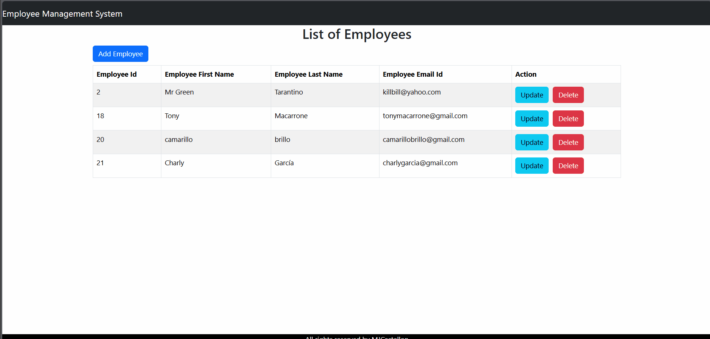

# Employee Management System

This is an employee management system developed with Spring Boot, React, Bootstrap and MySQL. It allows to perform CRUD (Create, Read, Update, Delete) operations on employees.

## 📌 **Technologies Used**

- Backend: , ,  
- Frontend: , , 
- Base de Datos: 

## ⚙️ **Installation & Configuration**

### 🔧 Prerequisites

Make sure you have the following software installed:

- ✅ Java 17 or later
- ✅ Node.js y npm
- ✅ MySQL
- ✅ Maven

## 🛠️ **Database configuration**

### Create a database in MySQL:

```sql
CREATE DATABASE employee_management;
```

### Configure credentials in application.properties or application.yml (as appropriate):

```sql
spring.application.name=ems-backend
spring.datasource.url=jdbc:mysql://localhost:3306/ems
spring.datasource.username=TU_USUARIO
spring.datasource.password=TU_CONTRASEÑA
```

### ▶️ Running the Backend

Go to the backend directory:
```sql
  cd backend
```

### Compile and run the project with Maven:

```sql
mvn spring-boot:run
```

### ▶️ Running the Frontend

Go to the frontend directory:

```bash
cd frontend
```

### Install the dependencies:

```bash
npm install
```

### Start the application:

```bash
npm run dev
```

## 🌐 API Endpoints

- **GET** /api/employees: Get all employees
- **POST** /api/employees: Add a new employee
- **PUT** /api/employees/{id}: Update an employee
- **DELETE** /api/employees/{id}: Delete an employee

‘’ 🚀 Future Enhancements

- 🔐 Implementation of authentication and authorisation (JWT, OAuth, etc.)
- 📦 Docker implementation for easy deployment
- 🧪 Implementation of unit and integration tests

🤝 Contributions

If you want to contribute, create a fork of the repository, make your changes in a new branch and send a pull request.

🔔 **Note:** This project is currently configured for local development only. It is not recommended for deployment in production environments without proper security measures.

## 🌍 Live Demo

  

